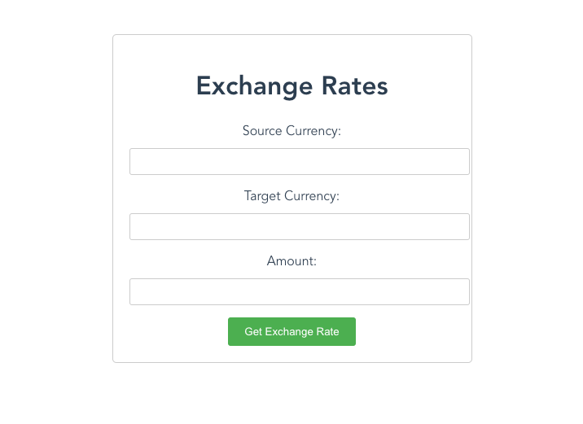

# Currency Exchange using SWOP API

## Introduction
This project is a Spring Boot application providing an open API for currency exchange. It allows users to retrieve exchange rates for different currencies and perform currency conversions. The application employs various technologies such as Spring Boot with WebFlux for asynchronous and non-blocking processing, Caffeine cache for optimizing performance, Spring Security for CSRF (Cross-Site Request Forgery) and CSP (Content Security Policy) protection, InfluxDB with Grafana integration for monitoring system metrics, and Docker Compose for easy deployment and management.

## Stack Used
- ```Spring Boot with WebFlux``` Enables asynchronous and reactive programming, enhancing performance and scalability.
- ```Caffeine Cache``` Improves response time by caching frequently accessed data.
- ```Spring Security (CSRF and CSP)``` Provides security measures to prevent common web vulnerabilities.
- ```InfluxDB with Grafana Integration``` Stores and visualizes system metrics for monitoring and analysis.
- ```Docker Compose``` Simplifies deployment and management of containerized applications.

## Prerequisites
To run this project, you will need the following:
- ```Docker``` - ```brew install docker```
- ```IntelliJ IDEA``` - [Reference](https://www.jetbrains.com/help/idea/installation-guide.html)
- ```Java 17``` 
- ```InfluxDB``` - ```brew install influxdb``` to start the server use: ```brew services start influxdb```
- ```Grafana``` - ```brew install grafana``` to start grafana use: ```brew services start grafana```

### For optional metrics setup:
1. Access InfluxDB at http://localhost:8086 and configure the project with the following details:
    - User: ```admin```
    - Password: ```password```
    - Organization: ```swop-api```
    - Bucket: ```swop-api-metrics```
2. Obtain the API key provided by InfluxDB after setup and replace it with ```management.influx.metrics.export.token=Token asdawd...``` in the application.yml file.
3. Configure Grafana at http://localhost:3000 with the default credentials:
    - Username: admin
    - Password: admin (remember to reset the password after initial login).
4. Add InfluxDB as a data source in Grafana for visualization of metrics. Example: [Tutorial](https://docs.influxdata.com/influxdb/cloud/tools/grafana/#:~:text=In%20the%20left%20navigation%20of,for%20your%20InfluxDB%20data%20source)

## How to Start
### IntelliJ way: 
1. Open the project, and run the influx and grafana before anything else [OPTIONAL] 
2. Build the project with gradle or run in the terminal `./gradlew build`
3. Start the application with IntelliJ
### Docker way: 
1. Run the provided docker-compose.yml. This will start all three images influx, grafana, and the swop-api.
2. Optional steps: 
     1. Configure metrics as per optional section [above](#For-optional-metrics-setup).
     2. Build the project again with `./gradlew build`
     3. Run the provided docker-compose.yml file.

   
##  Swagger Documentation

Access the Swagger documentation at [http://localhost:9090/webjars/swagger-ui/index.html](http://localhost:9090/webjars/swagger-ui/index.html) to explore the documentation for the API endpoints and their usage.

## Testing the API
You can test the API either directly from Swagger or using the following `curl` command:
```bash
curl --location 'http://localhost:9090/api/currency/exchange?base_currency=USD&target_currency=EUR&amount=140'
```

## Accessing the UI
You can access the ui on http://localhost:63342 once the service has been started. Should look something like this: 



